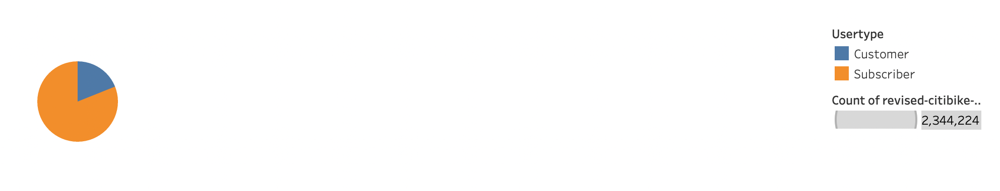
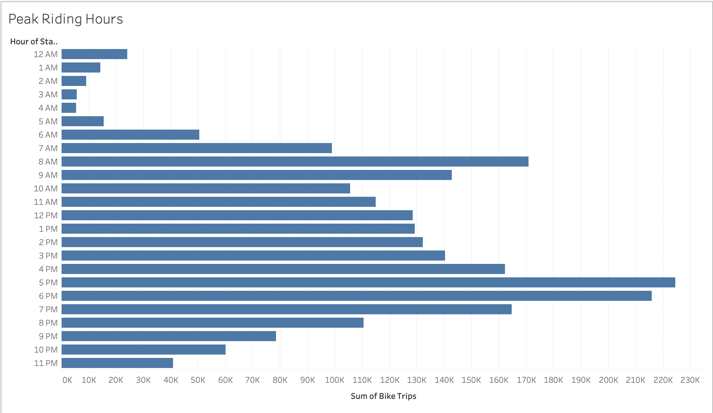
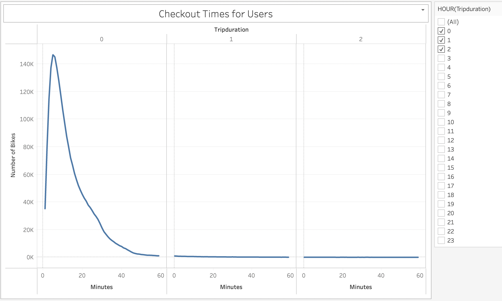
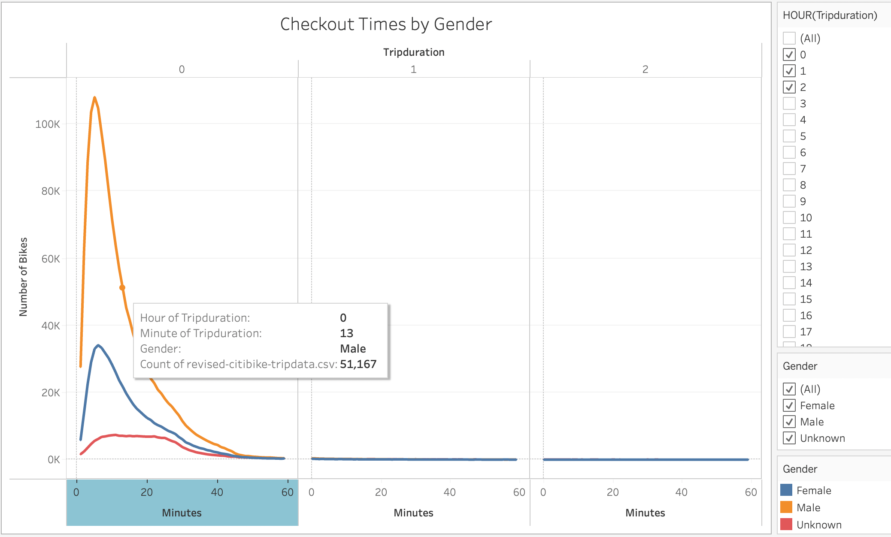
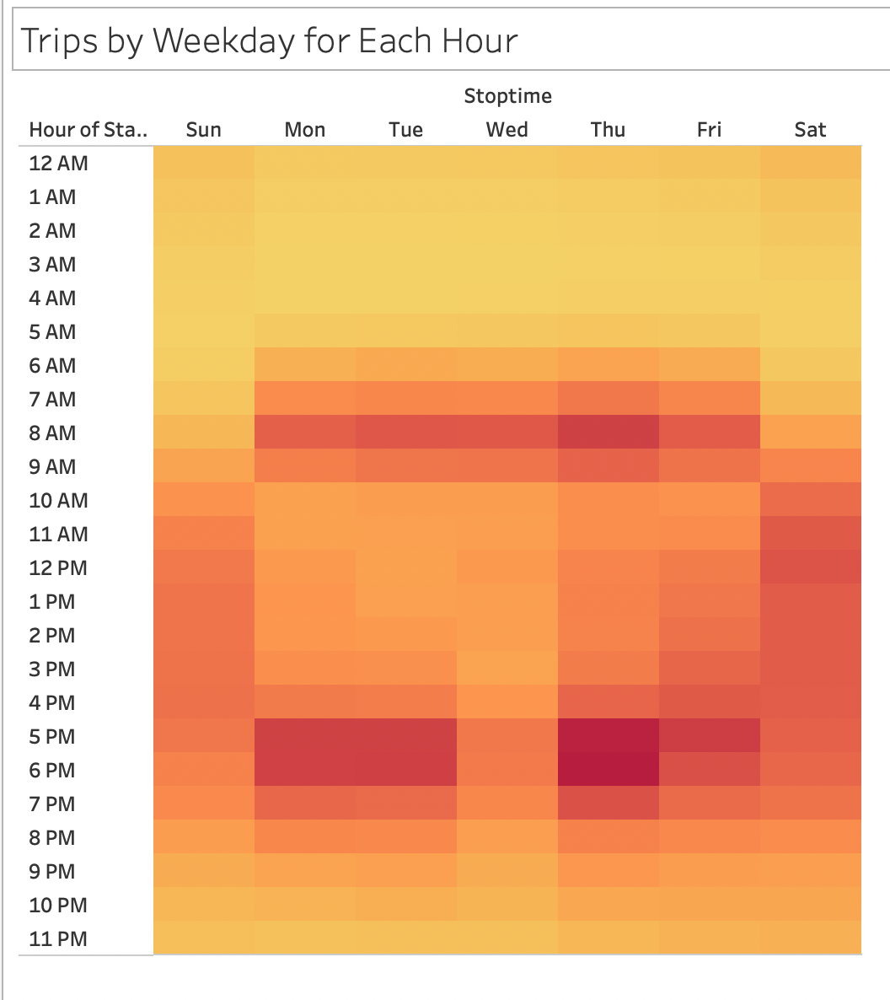
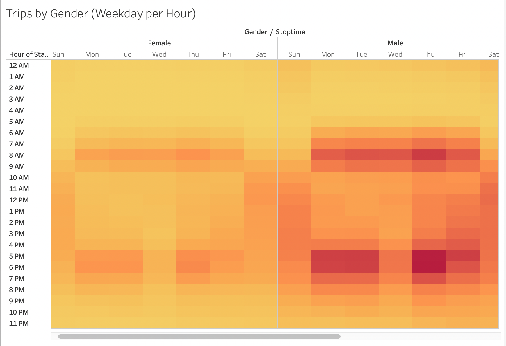
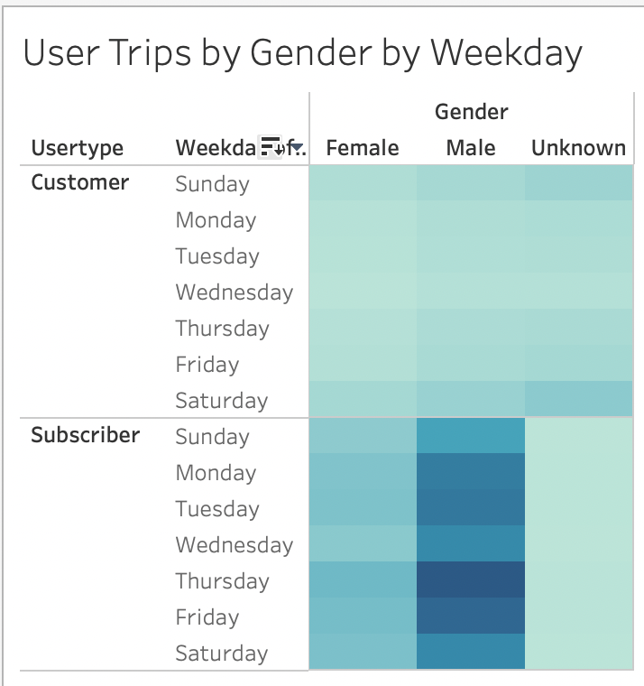

# Bike Sharing

## Overview of the analysis:

Wanting to start a bike share business in Des Moines, Iowa, I am analysing data from a bike share company in New York City to help understand the bike share business and to present information to potential investors.

## Results:

- Pie graph showing the proportion of short-term customers to annual subscribers

- Bar graph showing the peak riding hours in August

- Line graph displaying the number of bikes checked out by duration for all users, and the graph can be filtered by the hour

- Line graph displaying the number of bikes that are checked out by duration for each gender by the hour, and the graph can be filtered by the hour and gender

- Heatmap showing the number of bike trips for each hour of each day of the week

- Heatmap showing the number of bike trips by gender for each hour of each day of the week, and the heatmap can be filtered by gender

- Heatmap showing the number of bike trips for each type of user and gender for each day of the week, and you can only filter by user and gender

## Summary: Provide a high-level summary of the results and two additional visualizations that you would perform with the given dataset.

- 81% of users are paid subscribers to the bike service. 19% are occasioanl customers.
- Peak riding hours are between 7:00 AM and 9:00 PM, with the most traffic occuring between 7:00 AM - 10:00 AM and 4:00 PM - 9:00 PM. 
- Most bike trips last less than 30 minutes with most lasting only 5 minutes.
- The biggest group of users are male subscribers.

Two additional visualizations that I would perform with the given dataset would be to determine at the age group of the most common customer and try to figure out the directions riders are traveling per time of day.
